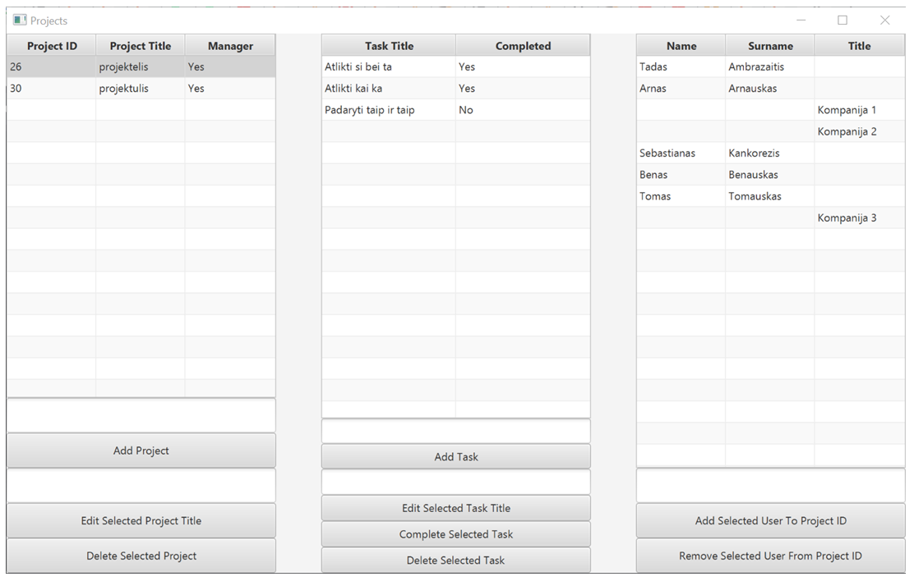
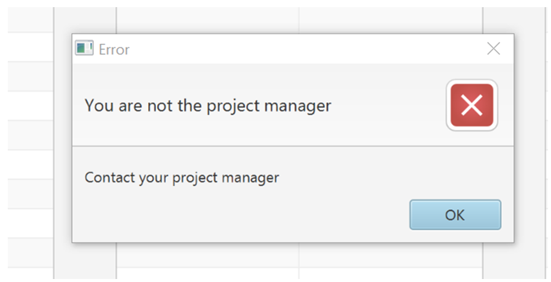

# Arkanoid Clone (Game) [Java]
Implementation of the classic arcade Arkanoid. Break all the bricks without losing the ball to win.

# Heaven To Hell (Game) [Python]
Fall from sunny heaven to burning hell through grass, mud and stone while avoiding obstacles to earn points.

# ToDoList (App) [Java]
Application to manage projects, tasks and team members. With login, registration and CRUD functions using RESTful API, Java FX, MySQL, Tomcat.

# Delfi.lt News Scraper (Script) [Python]
A web crawler/scraper that automatically visits Delfi.lt, gets headlines, links and short summaries, then sorts news by comment count and exports data to csv file.
Strictly personal script for academic purposes, not intended for commercial use. Script is not uploaded to the repository.

